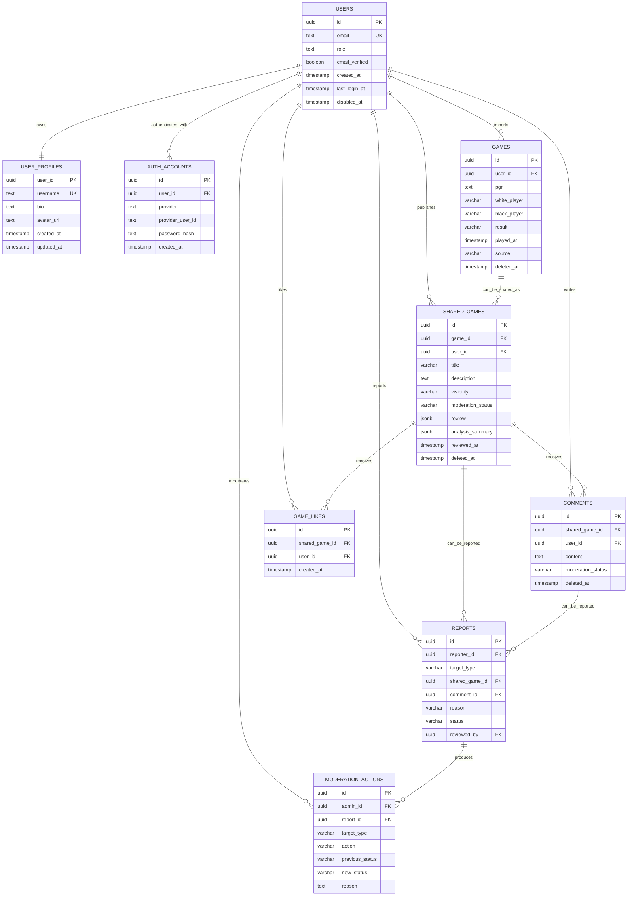

```mermaid
erDiagram
    USERS {
        uuid id PK
        text email UK
        text role
        boolean email_verified
        timestamp created_at
        timestamp last_login_at
        timestamp disabled_at
    }

    USER_PROFILES {
        uuid user_id PK
        text username UK
        text bio
        text avatar_url
        timestamp created_at
        timestamp updated_at
    }

    AUTH_ACCOUNTS {
        uuid id PK
        uuid user_id FK
        text provider
        text provider_user_id
        text password_hash
        timestamp created_at
    }

    GAMES {
        uuid id PK
        uuid user_id FK
        text pgn
        varchar white_player
        varchar black_player
        varchar result
        timestamp played_at
        varchar source
        timestamp deleted_at
    }

    SHARED_GAMES {
        uuid id PK
        uuid game_id FK
        uuid user_id FK
        varchar title
        text description
        varchar visibility
        varchar moderation_status
        jsonb review
        jsonb analysis_summary
        timestamp reviewed_at
        timestamp deleted_at
    }

    COMMENTS {
        uuid id PK
        uuid shared_game_id FK
        uuid user_id FK
        text content
        varchar moderation_status
        timestamp deleted_at
    }

    GAME_LIKES {
        uuid id PK
        uuid shared_game_id FK
        uuid user_id FK
        timestamp created_at
    }

    REPORTS {
        uuid id PK
        uuid reporter_id FK
        varchar target_type
        uuid shared_game_id FK
        uuid comment_id FK
        varchar reason
        varchar status
        uuid reviewed_by FK
    }

    MODERATION_ACTIONS {
        uuid id PK
        uuid admin_id FK
        uuid report_id FK
        varchar target_type
        varchar action
        varchar previous_status
        varchar new_status
        text reason
    }

    USERS ||--|| USER_PROFILES : owns
    USERS ||--o{ AUTH_ACCOUNTS : authenticates_with
    USERS ||--o{ GAMES : imports
    USERS ||--o{ SHARED_GAMES : publishes
    USERS ||--o{ COMMENTS : writes
    USERS ||--o{ GAME_LIKES : likes
    USERS ||--o{ REPORTS : reports
    USERS ||--o{ MODERATION_ACTIONS : moderates

    GAMES ||--o{ SHARED_GAMES : can_be_shared_as
    SHARED_GAMES ||--o{ COMMENTS : receives
    SHARED_GAMES ||--o{ GAME_LIKES : receives
    SHARED_GAMES ||--o{ REPORTS : can_be_reported
    COMMENTS ||--o{ REPORTS : can_be_reported
    REPORTS ||--o{ MODERATION_ACTIONS : produces
```